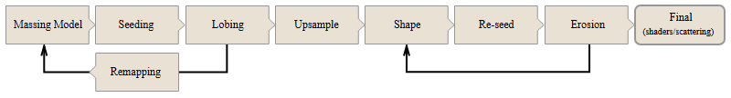

  

## Massing

Massing involves blocking out the large-scale structure of the terrain in three dimensions. For example, in a mountainous terrain, how much space the mountains will occupy, the shape of the space they enclose, where the mountains are higher and lower.

In heightfields, this means creating a basic, low-resolution field that has the general characteristics of the final terrain. The surfaces can be smooth or blocky at this stage, we’ll add noise later.

## Seeding

Seeding is the process of adding small disturbances to smooth surfaces to make them more natural. The less smooth the surfaces, the more realistic erosion will be later.

Simply adding overall noise to the field alone, or projecting large-scale geometry alone, often does not create enough “obstacles” (features that water and soil must move around) to create interesting erosion. Seeding is about adding those obstacles.

One useful trick is to create a 3D model of a large field of random jagged rocky shapes (for example, using the Mountain SOP), then painting a mask on your heightfield (with falloff) and only projecting the rocky geometry into the masked area. Then add Distory by Layer or Distort by Noise on top of that.

## Lobing

Mountain formations are often broken into smaller sections, which can be thought of as lobes. Lobing is the process of taking a low resolution heightfield and using Heightfield Erode to cut a mountain into smaller sections.

Turn up precipitation, cut angles, and sediment capacity on the Erode node to get the cutting effect.

## Remapping 

Remapping involves repeating the massing/seeding/lobing steps multiple times to create different levels (for example foothills, low mountains, high mounbtains).

The trick is to build your terrain in “Elevation Passes”. After the previous Heightfield Erode, add a Heightfield Remap and remap the elevation, compressing the field vertically. Then repeat the massing/seeding/lobing step over top of the previous now-compressed contents.

## Upsampling

When you're finished “lobing” you need to upsample the heightfield to a higher resolution so erosion has greater detail.

Use Heightfield Resample to double the field’s resolution. (You will probably want to iterate this process so do not resample to high at first.)